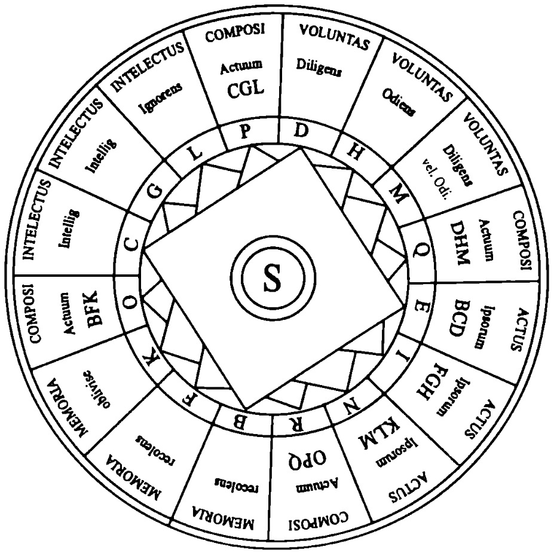

# Ramon Llull's Thinking Machine of Ideation
This is the Github repo for Ramon Llull's Thinking Machine of Ideation 

## Ramon Llull's Thinking Machine
[Ramon Llull's Thinking Machine](https://gwern.net/doc/borges/1937-borges-raymondllullsthinkingmachine.pdf) was invented at the end of the thirteenth century as an instrument of philosophical investigation with multiple rotatable discs of concepts to generate logical combinations as an answer to theological questions.

  

In this project, we aim to create vibe research paper titles in a Ramon Llull's Thinking Machine way, i.e., change the "A" in the figure to "LLM". The generated paper titles and outlines can potentially serve as a baseline for [automated idea generation](https://arxiv.org/abs/2409.04109) and [AI research outcome prediction](https://arxiv.org/pdf/2506.00794).

We would like to highlight a very relevant paper studying ideation from the human-AI collaboration perspective: [Scideator](https://www.semanticscholar.org/reader/1343dedea56bbf3ba48d0971aee177b5add61105), which explores facet-based combination of ideation.

## The Holy Discs:
At the current stage of the project, we identify three disks of concepts:

1. Theme (A): some themes of research direction, e.g., few-shot.

2. Domain (B): some domains of tasks people work on, e.g., argument mining.

3. Method (C): some methods orarchitecture of the research, e.g., Mamba

There are other components to make sure that control the expressions:

1. Template: a template to organize the idea, e.g., Comparing C1 and C2 in B under A

2. Prompt: a prompt to ask the LLM to polish a template into a research paper title.

## Sources of the concept discs
A seed set from the author's experience.

## Demo
You can check **./main.ipynb** or copy the generated prompt to the Chatbot Web Interface.

## To-dos:
1. Fetch the components from experts and OpenReview data;
2. Create advanced templates and use co-occurrence to steer the sampling;
3. Add fancy punchlines within A,B,C or as a separate D, e.g., xxx is all you need

## Discussion
1. \[**Important**\] The quality and the completeness of an idea are orthogonal to whether it can be covered by Ramon Llull's Thinking Machine of Ideation, since given the same A+B+C. The angles and depth of the analysis and findings can be very different.
2. This tool is not designed to DDoS the conference review system or detect if certain papers are AI-generated.

## Research Questions and Analysis
Research questions:
1. The precision and recall of the generated ideas with the actual *CL or ML Conference papers;
2. How much novelty can we get from these ideas (human annotation);
3. What are the patterns of the out-of-box ideas in the conferences beyond Ramon Llull's thinking machine?

Analysis
1. Self-evolve Ramon Llull's thinking machine;
2. The variance of the out-of-box ideas in the conferences vs. the in-box generatable ideas;
3. How to classify trivial/meaningful, doable/undoable ideas generated?
4. Analyze the paradigm shift (research trends) through the years with this tool
5. The charm of "not"
6. Can it serve as a version of templated related work search?

Future Work
1. Serve as diverse samples for downstream execution or feasibility evaluation;
2. Sample 1,000 high-quality ideas for human researchers to execute upon agreement (See [this](https://stratup.ai/en));
3. Sample many ideas to hit the next conference titles
4. An API on generating your daily idea, with random seed/novelty/feasibility control
5. The same framework can be relevant to (1) story generation, (2) synthetic data generation, and (3) model editing.

## Acknowledgements
Collaborators (alphabetic): {Chenglei Si, Ken Liu, Xiang Li, Yiming Zhang, Tong Chen, Runlong Zhou, Ruochen Li, Haofei Yu, Boyuan Zhang, Tongshuang Wu}

The idea of template extraction comes from previous knowledge graph literature, i.e., [ASER](https://arxiv.org/abs/1905.00270). Similarly to the conceptualization idea, A/B/Cs can also be hierarchical, e.g., Linear transformers consist of RetNet, (Gated) DeltaNet, Mamba, RWKV, etc.

## Interested?
Our target venue: 
1. [LLM4Sci @ COLM 25](https://lm4sci.github.io/)
2. [ACH 2026](https://sigbovik.org/)

If you would like to contribute your concept words or if there is any suggestion, you are welcome to open an issue or send me an [email](mailto:xinranz3@andrew.cmu.edu), I will respond to that as soon as possible.
